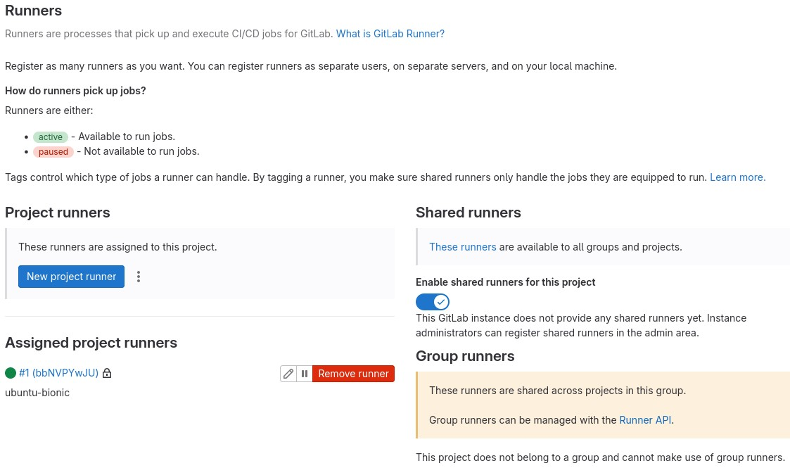
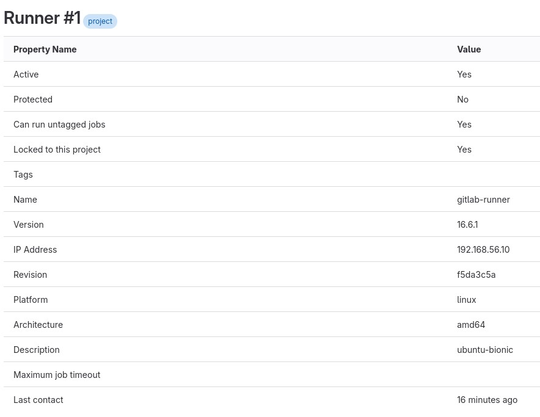
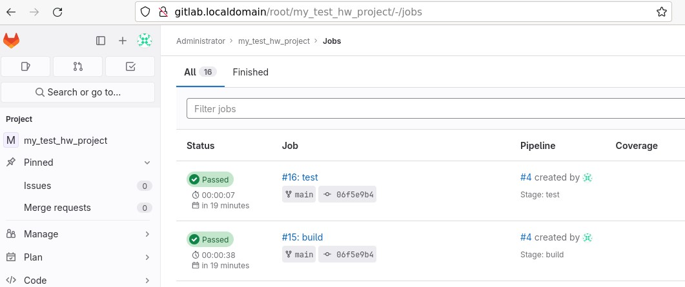
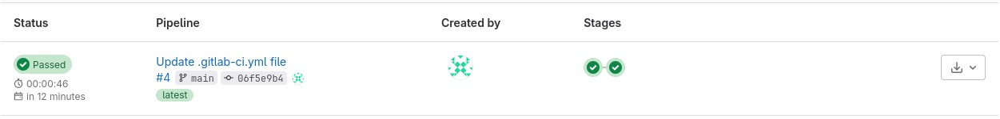
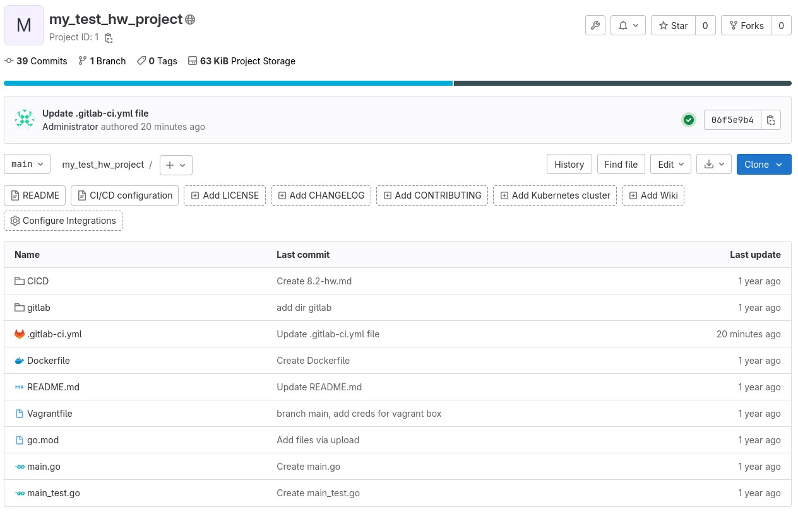

# Домашнее задание к занятию «GitLab» - Михалёв Сергей

## Задание 1

1. Разверните GitLab локально, используя Vagrantfile и инструкцию, описанные в [этом репозитории](https://github.com/netology-code/sdvps-materials/tree/main/gitlab).
2. Создайте новый проект и пустой репозиторий в нём.
3. Зарегистрируйте gitlab-runner для этого проекта и запустите его в режиме Docker. Раннер можно регистрировать и запускать на той же виртуальной машине, на которой запущен GitLab.

### Решение
Скриншоты с настройками раннера в проекте:
* 
* 

---

### Задание 2

1. Запушьте [репозиторий](https://github.com/netology-code/sdvps-materials/tree/main/gitlab) на GitLab, изменив origin. Это изучалось на занятии по Git.
2. Создайте .gitlab-ci.yml, описав в нём все необходимые, на ваш взгляд, этапы.

В качестве ответа в шаблон с решением добавьте:

### Решение
- Pipeline

```yaml
stages:
  - test
  - static-analysis
  - build

test:
  stage: test
  image: golang:1.16
  script: 
   - go test .

static-analysis:
 stage: test
 image:
  name: sonarsource/sonar-scanner-cli
  entrypoint: [""]
 variables:
 script:
  - sonar-scanner -Dsonar.projectKey=git_project -Dsonar.sources=. -Dsonar.host.url=http://gitlab.localdomain:9000 -Dsonar.login=sqp_5f4b4be6cbc6f92b5db6bafdb3091491ec72612f

build:
  stage: build
  image: docker:latest
  script:
   - docker build .
```
- Cкриншоты с успешно собранными сборками.
   * 
   * 
   * 


---
